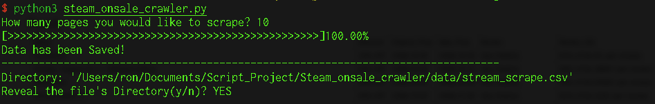
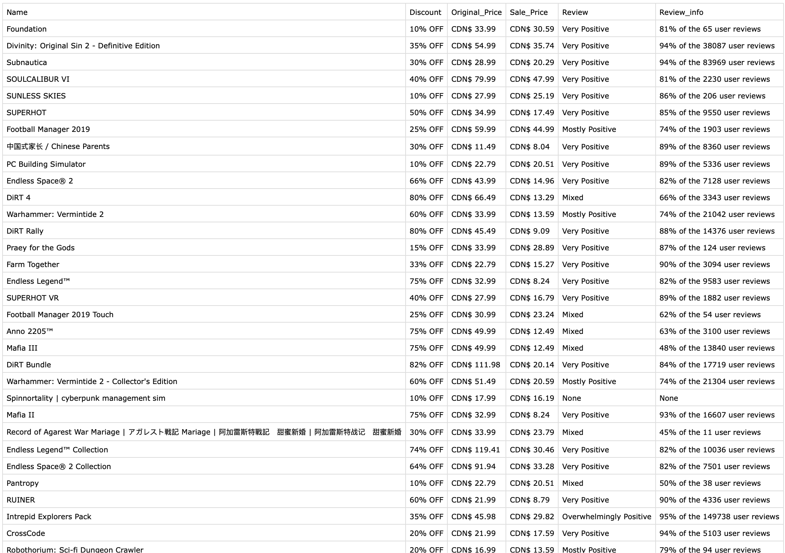

# Steam [on sale game] Crawler  

#### 1. Chang directory `cd` to the folder of `steam_onsale_crawler.py`  

#### 2. Executed with python3  
>All the data is going to be saved as a `CSV file` into the `data` folder at the current folder.  

```
python3 steam_onsale_crawler.py
How many pages you would like to scrape? 
```

`Input: (A Integer)`  

#### 3. Reveal to the directory  

```
Reveal the file's Directory(y/n)? 
```

`Input: (A String)`  

```python
if input in ["y", "Y", "yes", "Yes", "YES"]: #Reveal the directory in Finder
```

  

Result:  
  
